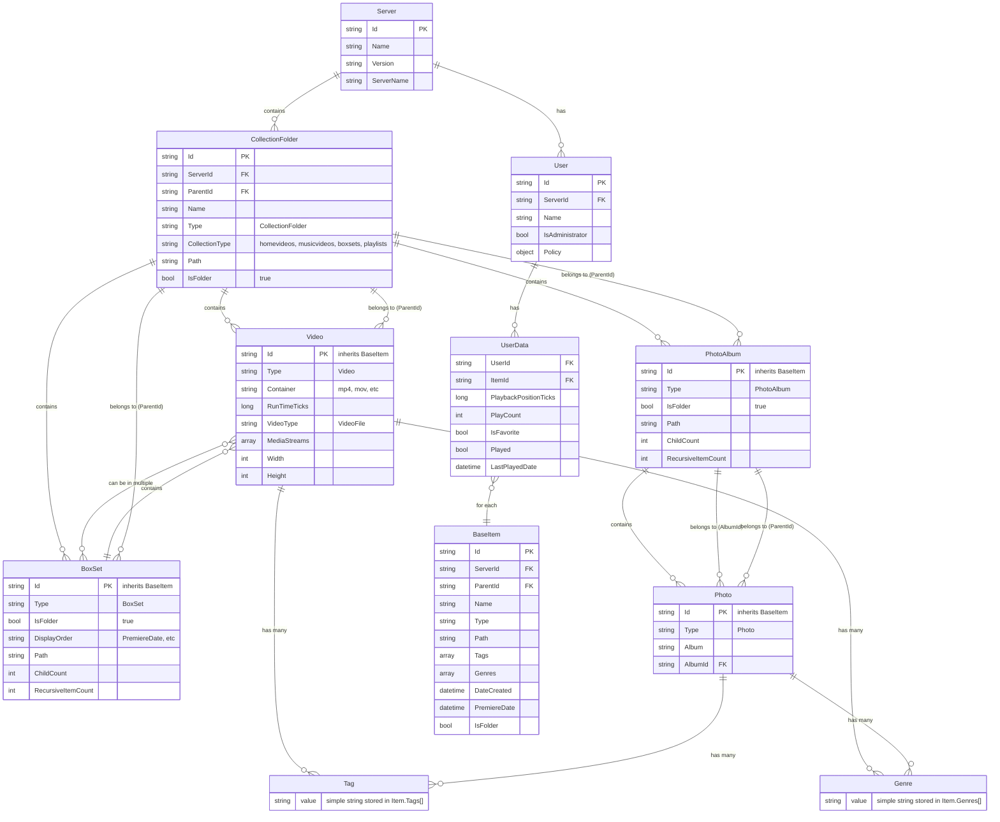

# Jellyfin Data Model for Media Management

**Version:** Jellyfin 10.10.7
**Focus:** Photos, Videos, Collections, Tags, and Genres
**Excludes:** Music albums/tracks, TV series/episodes, actors/people

## Entity Relationship Diagram



## Core Entities Explained

### Server
The Jellyfin server instance. All entities belong to a server via `ServerId`.

### User
User accounts with permissions and preferences. Users have individual `UserData` for each item tracking playback status, favorites, etc.

### CollectionFolder (Library)
Top-level media containers defined in Jellyfin settings. These are the main organizational units:
- **homevideos**: Personal video content
- **musicvideos**: Music video clips
- **boxsets**: Container for BoxSet collections
- **playlists**: User-created playlists

Each CollectionFolder has a `Path` pointing to a filesystem directory.

### BaseItem (Abstract)
The base entity for all media items. All items have:
- `ParentId`: Points to containing folder (CollectionFolder, PhotoAlbum, or BoxSet)
- `Tags[]`: User-defined labels (flat array of strings)
- `Genres[]`: Predefined categories (flat array of strings)
- `Path`: Filesystem location

### Video
Video media files (mp4, mov, etc.). Videos can:
- Belong to a CollectionFolder via `ParentId`
- Be added to one or more BoxSets
- Have Tags and Genres
- Contain multiple MediaStreams (video, audio, subtitles)

### Photo
Image files (jpg, png, etc.). Photos:
- Belong to a PhotoAlbum via `AlbumId` and `ParentId`
- Have Tags and Genres
- Album name stored in `Album` field

### PhotoAlbum
Folders containing photos. Albums:
- Are filesystem directories represented as Jellyfin items
- Belong to a CollectionFolder via `ParentId`
- Can have nested structure (sub-albums)
- Track `ChildCount` and `RecursiveItemCount`

### BoxSet (Collection)
User-created collections of videos. BoxSets:
- Group related videos together
- Stored in `/var/lib/jellyfin/data/collections/`
- Belong to the "boxsets" CollectionFolder
- Videos can be in multiple BoxSets
- Have `DisplayOrder` to control sorting
- **Do NOT support hierarchical nesting** - all collections are flat at the same level
- Use naming conventions for hierarchy (e.g., "Location-Inside-Bedroom" or "Location: Inside: Bedroom")

### Tag
Simple string labels attached to items. Tags:
- Stored directly in `Item.Tags[]` array
- No separate entity or table
- Case-sensitive
- Can be queried at `/Items/Filters` endpoint
- Examples: "Bondage", "anatomy", "Funny", "sexy pics"

### Genre
Similar to Tags but typically used for media categories. Genres:
- Stored directly in `Item.Genres[]` array
- No separate entity
- Can be queried at `/Genres` endpoint
- Examples: "FFM"

### UserData
Per-user metadata for each item:
- Playback position
- Play count
- Favorite status
- Last played date
- Allows different users to have independent tracking

## Key Relationships

### Parent-Child Hierarchy
```
Server
└── CollectionFolder (Library)
    ├── Video (direct child)
    ├── PhotoAlbum
    │   └── Photo
    └── BoxSet
        └── Video (reference, not move)
```

All items have a `ParentId` pointing to their container:
- Videos in a library: `ParentId` → CollectionFolder
- Photos in an album: `ParentId` → PhotoAlbum, `AlbumId` → PhotoAlbum
- Albums: `ParentId` → CollectionFolder
- BoxSets: `ParentId` → internal BoxSet parent folder

### Collections (BoxSets)
BoxSets are special because they **reference** videos rather than containing them:
- Videos remain in their original CollectionFolder
- BoxSet creates a virtual grouping
- A video can be in multiple BoxSets
- Adding to BoxSet doesn't change video's `ParentId`

### Tags and Genres
Both are stored as simple string arrays on items:
- `Tags[]`: User-defined, freeform labels
- `Genres[]`: Categories (often auto-populated by media info providers)
- No hierarchical structure in Jellyfin (flat only)
- No synonym support in Jellyfin (unlike media_library)

## API Endpoints Reference

### Authentication
All requests require header:
```bash
Authorization: MediaBrowser Token="YOUR_API_KEY"
```

### Key Endpoints

#### Get Libraries
```bash
GET /Library/MediaFolders
```
Returns all CollectionFolders (top-level libraries).

#### Get Items (with filtering)
```bash
GET /Users/{UserId}/Items?Recursive=true&IncludeItemTypes=Video,Photo&Tags=tagname&Fields=Path,Tags,Genres,ParentId
```
Parameters:
- `Recursive=true`: Search all subfolders
- `IncludeItemTypes`: Filter by type (Video, Photo, PhotoAlbum, BoxSet)
- `Tags`: Filter by tag name
- `Genres`: Filter by genre
- `ParentId`: Get items in specific container
- `Fields`: Include additional fields (Path, Tags, Genres, etc.)

#### Get Item Details
```bash
GET /Users/{UserId}/Items/{ItemId}?Fields=Path,Tags,Genres,ParentId
```

#### Get Available Tags and Genres
```bash
GET /Items/Filters?UserId={UserId}
```
Returns all tags, genres, years used in the library.

#### Get Collections (BoxSets)
```bash
GET /Items?UserId={UserId}&IncludeItemTypes=BoxSet&Recursive=true
```

#### Get Items in Collection
```bash
GET /Users/{UserId}/Items?ParentId={BoxSetId}
```

#### Update Item Metadata
```bash
POST /Items/{ItemId}
Content-Type: application/json

{
  "Tags": ["tag1", "tag2"],
  "Genres": ["genre1"]
}
```

#### Add Item to Collection
```bash
POST /Collections/{CollectionId}/Items?Ids={ItemId}
```

#### Remove Item from Collection
```bash
DELETE /Collections/{CollectionId}/Items?Ids={ItemId}
```

#### Create New Collection
```bash
POST /Collections
Content-Type: application/json

{
  "Name": "Collection Name",
  "Ids": ["itemId1", "itemId2"]
}
```

## Best Practices for API Access

### 1. Always Use UserId in Queries
User-specific endpoints respect permissions and return personalized data:
```bash
# Good
GET /Users/{UserId}/Items

# Less flexible
GET /Items
```

### 2. Request Only Needed Fields
Use `Fields` parameter to get additional data without separate queries:
```bash
GET /Items/{ItemId}?Fields=Path,Tags,Genres,Studios,ParentId,ProviderIds,Overview
```

### 3. Filter Early
Use API filtering rather than fetching everything:
```bash
# Good - filter on server
GET /Items?IncludeItemTypes=Video&Tags=Bondage

# Bad - fetch all and filter locally
GET /Items (then filter in code)
```

### 4. Use Recursive Queries
For deep searching across folders:
```bash
GET /Users/{UserId}/Items?Recursive=true&IncludeItemTypes=Video
```

### 5. Batch Operations
When updating multiple items, use loops but consider rate limiting.

### 6. Handle Paging
For large libraries:
```bash
GET /Items?StartIndex=0&Limit=100
# Then StartIndex=100&Limit=100, etc.
```

### 7. Cache Filter Lists
The `/Items/Filters` endpoint is useful for getting all available tags/genres. Cache this and refresh periodically rather than querying for each operation.

## Tag Management: Jellyfin vs media_library

### Jellyfin Tag System
- **Flat structure**: Tags are simple strings in an array
- **No hierarchy**: Cannot represent "Location/Inside/Bedroom"
- **No synonyms**: Each tag is independent
- **Case-sensitive**: "Bondage" ≠ "bondage"
- **Freeform**: Any string can be a tag

### media_library Tag System
- **Hierarchical**: Tags can have parent/child relationships using "/" notation
- **Typed**: Tags have types (container vs leaf)
- **Synonyms**: Multiple terms can map to canonical tags
- **Database-backed**: SQLite database with referential integrity
- **Structured**: Tags must exist before use

### Integration Challenges
When syncing tags from media_library to Jellyfin:

1. **Flatten hierarchy**:
   - media_library: `Location/Inside/Bedroom`
   - Jellyfin: Could become `["Location", "Inside", "Bedroom"]` or `["Location:Inside:Bedroom"]`

2. **Expand synonyms**:
   - media_library: "BJ" → canonical "Oral"
   - Jellyfin: Store canonical form or both?

3. **Tag proliferation**:
   - Breaking hierarchies creates many tags
   - Consider which tags are useful for filtering

4. **Bidirectional sync**:
   - Jellyfin tags don't map back to media_library structure
   - Need strategy for new tags created in Jellyfin

## Common Queries

### Find Untagged Items
```bash
GET /Users/{UserId}/Items?Recursive=true&IncludeItemTypes=Video,Photo&Fields=Tags&HasTag=false
```
(Note: API may not support HasTag=false, may need to filter results)

### Get All Tags
```bash
GET /Items/Filters?UserId={UserId}
```
Returns `{"Tags": ["tag1", "tag2", ...], "Genres": [...], ...}`

### Search by Multiple Tags
```bash
GET /Users/{UserId}/Items?Tags=tag1,tag2&Recursive=true
```
(Note: Check if this is AND or OR logic)

### Get Items Modified Since Date
```bash
GET /Users/{UserId}/Items?MinDateLastSaved=2025-01-01T00:00:00Z
```

### Count Items by Tag
```bash
GET /Users/{UserId}/Items?Tags=tagname&Recursive=true
```
Returns `TotalRecordCount` in response.

## Implementation Notes

### For media_library Integration

#### Collection Strategy (Recommended)
Since Jellyfin Collections provide better UX than tags but don't support nesting:

1. **Flatten Hierarchical Tags to Collections**:
   - media_library: `Location/Inside/Bedroom`
   - Jellyfin: Collection named "Location-Inside-Bedroom" or "Location: Inside: Bedroom"
   - Use consistent delimiter (`:`, `-`, or `|`)

2. **Top-Level Tags as Collections**:
   - Map major container tags to Collections (e.g., "Bondage", "Instructional", "FFM")
   - Use regular Tags for leaf attributes (e.g., "anatomy", "dress sexy")

3. **Multiple Membership**:
   - Items can be in multiple collections
   - Maintain the flexibility of your hierarchical tag system

#### Tag Strategy
1. **Export Path**: media_library → Jellyfin
   - Query media_library for files with tags
   - Lookup files in Jellyfin by path
   - Update Jellyfin item tags via POST /Items/{ItemId}
   - Flatten hierarchical tags to appropriate format

2. **Import Path**: Jellyfin → media_library
   - Query Jellyfin for items with tags
   - Extract file paths
   - Map flat tags to hierarchical structure (challenging)
   - Insert into media_library database

3. **Sync Strategy**:
   - One-way sync (media_library → Jellyfin) is simpler
   - Two-way sync requires conflict resolution
   - Consider timestamp-based change detection

4. **Atomic Scripts**:
   - Keep existing philosophy of small, focused scripts
   - `ListCollections` - List all collections (implemented)
   - `CreateCollection` - Create new collection (implemented)
   - `jellyfin-get-item` - Fetch item by ID or path
   - `jellyfin-add-to-collection` - Add item(s) to collection
   - `jellyfin-update-tags` - Update tags on item
   - `sync-tags-to-jellyfin` - Export media_library tags/collections

## References

- Jellyfin API Documentation: http://granite.local:8096/api-docs/swagger/index.html
- Server Info: http://granite.local:8096/System/Info
- API Base URL: http://granite.local:8096
- API Key: Stored in `.env` file
